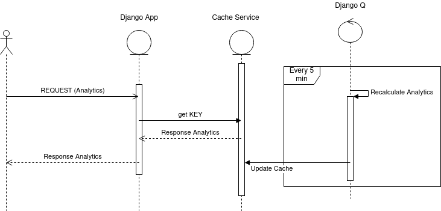

# session-analytics

There are two parts of this app:

1. Session CRUD
   Deals with CRUD operation on session database
2. Analytics
   Deals with analytics operation such as session by week,
   and average duration binned

## Installation

 1. Create `virtualenv` and install requirements
 2. Copy .env.sample file to .env
 3. Setup postgres database Configure .env
 4. Install redis server if not already
 5. Migrate using `python manage.py migrate`
 6. Schedule tasks using `python manage.py schedule_analytics_tasks`
 7. Run two services `python manage.py runserver` and `python manage.py qcluster`

## Considerations while designing this app

 **Tools used**:  `django`, `django-rest-framework`, `postgres`(database), `redis`(cache), `django-q`(background tasks)

 **Postgres Count query is slow for large tables, so maintained separate table to store count to make CRUD operation fast**

 **Pandas DataFrame vs SQL Query**
 - Loading whole database to DataFrame proved to be much slower than running groupby query.
 - RAW sql was a bit faster than django ORM

 **Cache and Background Task**
 Analytics is cached to achieve standard response time and background task is used to update the cache periodically
 
 ## Basic Flow of Analytics
 
 
